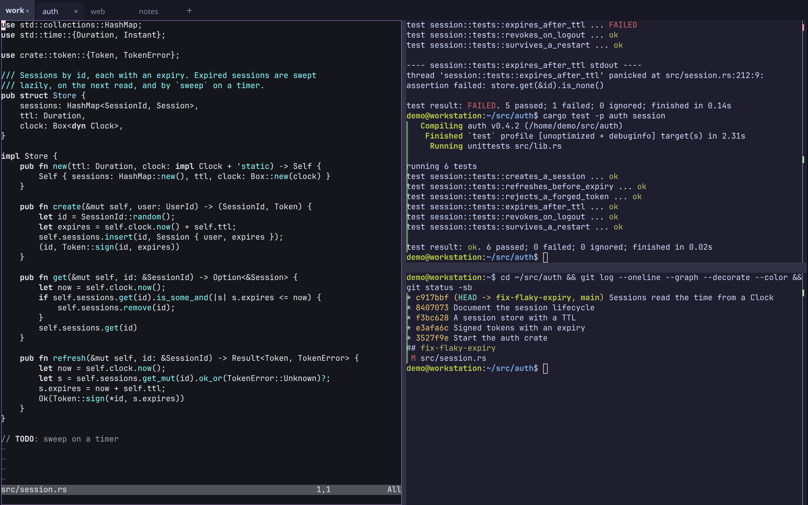
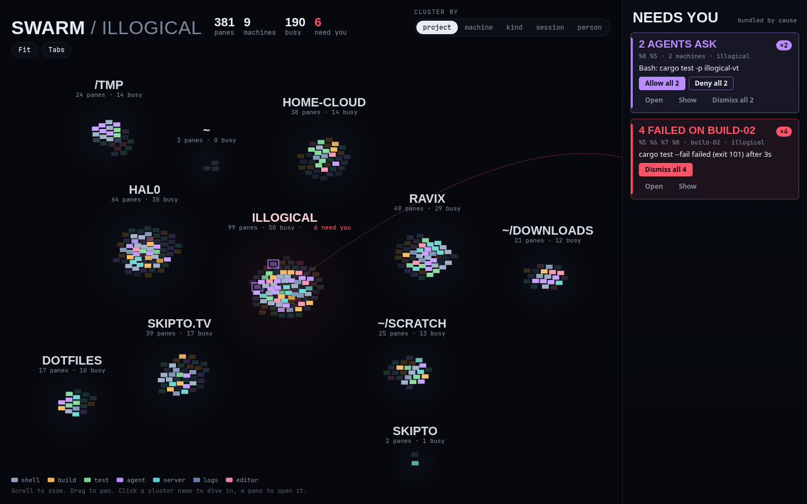

# illogical

A terminal multiplexer whose sessions outlive the window, the daemon and the
reboot. A daemon owns your terminals; the browser (desktop or phone) draws
tabs and splits you drive with the mouse.



- **Mouse first.** Click, drag and right-click for tabs and splits. No
  chords to learn, no prefix key.
- **Durable.** Close the window, lose the connection, restart the daemon or
  reboot: the layout, working directories and scrollback come back, and
  each pane does what you told it to (a shell where it was, re-run its
  command, `claude --continue`). On Linux a daemon restart doesn't even
  touch running programs.
- **Anywhere on your tailnet.** The same live layout on every window and
  your phone, over [Tailscale](https://tailscale.com). Push notifications
  when a pane rings, a long command finishes, or an agent needs you.
- **Agents as blocks.** Claude Code, Codex or any
  [ACP](https://agentclientprotocol.com) agent as a UI beside your
  terminals: tool calls with their output, approvals and questions as
  cards big enough for a thumb.
- **VS Code beside your terminals.** *Open in editor* (or `illogical edit
  src/main.rs:42`) opens VS Code on the pane's machine, in its directory,
  as a block: on the phone too, and back with its file after a restart.
- **What did the agent change?** *Changes* on a pane (or `illogical diff`)
  lists the files changed in its repository, on its machine, with +/−; tap
  a file for its hunks and a line to see the file there, both updating
  while the agent works. Phone first, and a failed build is a *Rerun* tap
  away.
- **The swarm.** Every pane on every machine you and your team can see, in
  one live view, clustered by project, machine, kind or person. Whatever
  needs someone (an agent asking, a build failing) lifts out to a rail of
  cards, where anyone on the team who may answer allows, answers or sends
  the agent its next instruction, and everyone sees who did.
- **Your editor in the swarm.** VS Code, Cursor or nvim (over Remote-SSH
  too) shows up beside your panes once you ask it to. Follow its cursor
  from your phone; a debugger stopping, or Claude Code wanting to edit a
  file, is a card you answer from anywhere.
- **Scriptable.** `illogical`, a CLI for scripts and agents: run, send,
  wait for a command or a match, tail, search every pane's history.
- **In any terminal, too.** `illogical tui` draws the same tabs and splits
  in the terminal you're in (over ssh as well), with a sidebar of what
  needs you: allow an agent's request from there without opening its pane.
  Select, search a pane's whole history and copy, to your own clipboard
  over ssh.



Linux (x86_64, arm64) and macOS (Apple silicon). Share a session with
someone, or a whole machine with a team, with roles and presence. Remote
access is over your tailnet, or through
[illogical control](docs/control.md) for devices without one: end to end
encrypted, so the service relays for your devices but can't read your
terminals.

## Install

```
curl -fsSL https://illogical.widgets.wtf/install.sh | sh
```

This puts `illogicald` and `illogical` in `~/.local/bin` and starts the
daemon as a service (systemd user unit on Linux, launchd agent on macOS).
Run it again to upgrade. `ILLOGICAL_VERSION=v0.1.0` picks a version.

**Homebrew** (macOS, Linux):

```
brew tap jhgaylor/tap https://git.inevitable.fyi/jhgaylor/homebrew-tap
brew install illogical
illogicald install
```

**From source:** see [docs/development.md](docs/development.md#build-from-source).

On Linux, let it start at boot, before you log in:

```
loginctl enable-linger $USER
```

## Quickstart

1. Open <http://127.0.0.1:7681>. Right-click a pane or a tab for
   everything. Drag a tab or a pane onto another pane's edge to split it
   there; drag dividers to resize.
2. **From your phone and other machines**, put it behind Tailscale on this
   machine:

   ```
   tailscale serve --bg --https=443 http://127.0.0.1:7681
   ```

   and open `https://<this machine>.<tailnet>.ts.net`. Only the Tailscale
   login that owns the machine gets in (`illogicald install -- --owner
   you@example.com` for someone else). On the phone, add it to the home
   screen, then *Notify this device* in the menu (☰).
3. **From a script or another pane:**

   ```
   illogical run --wait -- cargo build        # a new tab; exits with its exit code
   illogical send %3 'git status' -e          # type a line and press Enter
   illogical wait %3 --match 'listening on'
   illogical tail %3 -f --text
   illogical search 'panic|Traceback' --since 1d
   ```

   [docs/cli.md](docs/cli.md) has the rest.
4. **In a terminal**, or over ssh: `illogical tui`. The mouse works as in
   the browser; Ctrl-] is the menu key (Ctrl-] ? lists the rest).
5. **Without a tailnet**, add the machine to an account on illogical
   control and use it from any browser:

   ```
   illogicald join https://control.illogical.widgets.wtf
   ```

   See [docs/control.md](docs/control.md), including running your own.
6. **Agents.** Install an adapter (needs Node), then *Start an agent…* in a
   pane's menu, or `illogical agent "fix the failing test"`:

   ```
   npm install --prefix ~/.local/share/illogical/agents/claude @agentclientprotocol/claude-agent-acp@0.85.0
   npm install --omit=optional --prefix ~/.local/share/illogical/agents/codex @agentclientprotocol/codex-acp@2.1.0
   ```

   Claude Code in an ordinary pane can raise the same notifications,
   question cards and permission cards, and take follow-ups, through its
   hooks: see [Claude Code in a pane](docs/cli.md#claude-code-in-a-pane).
7. **As tools for any agent (MCP).** Give Claude Code (or Codex, or any
   MCP client) illogical's tools: it runs builds and dev servers in panes
   you can watch from the phone and take over, waits on them, starts and
   answers other agents, and searches what happened yesterday.

   ```
   claude mcp add illogical -- illogical mcp
   ```

   The read-only tools are safe to allow outright; leave the rest to ask.
   In `~/.claude/settings.json` (or the project's `.claude/settings.json`):

   ```json
   {
     "permissions": {
       "allow": [
         "mcp__illogical__read_output", "mcp__illogical__capture_screen", "mcp__illogical__wait",
         "mcp__illogical__list", "mcp__illogical__history", "mcp__illogical__search",
         "mcp__illogical__read_file", "mcp__illogical__list_conversations"
       ],
       "ask": [
         "mcp__illogical__run", "mcp__illogical__send_input", "mcp__illogical__close",
         "mcp__illogical__open_port", "mcp__illogical__start_agent", "mcp__illogical__agent_respond",
         "mcp__illogical__show_changes", "mcp__illogical__show_file", "mcp__illogical__open_conversation",
         "mcp__illogical__open_workspace"
       ]
     }
   }
   ```

   What it starts says "started by mcp:claude-code". Agent blocks get the
   same tools by themselves, limited to their own tab. Over HTTP, tokens,
   and the tools: [MCP](docs/cli.md#mcp).

## On macOS

Everything above works, except that restarting or upgrading the daemon
ends the panes' programs (there's no systemd to hold them); scrollback and
layout still come back. VM tabs are Linux only.

## More

- [docs/features.md](docs/features.md): everything it does, in detail.
- [docs/advanced.md](docs/advanced.md): VM tabs (wisp), web apps beside
  their terminals, more machines and sandboxes, iTerm2 as a tmux client.
- [docs/control.md](docs/control.md): illogical control, hosted or your
  own; [docs/control-e2e.md](docs/control-e2e.md), how it keeps out of your
  terminals.
- [docs/cli.md](docs/cli.md): the CLI and the HTTP API.
- [docs/development.md](docs/development.md): building, testing, the code's
  layout, and what building it taught us.
- [BRIEF.md](BRIEF.md) and [PLAN.md](PLAN.md): why it exists, the
  decisions and the milestones.

## License

MIT OR Apache-2.0, at your option. Terminal emulation by
[libghostty](https://ghostty.org); see [THIRD_PARTY.md](THIRD_PARTY.md).
